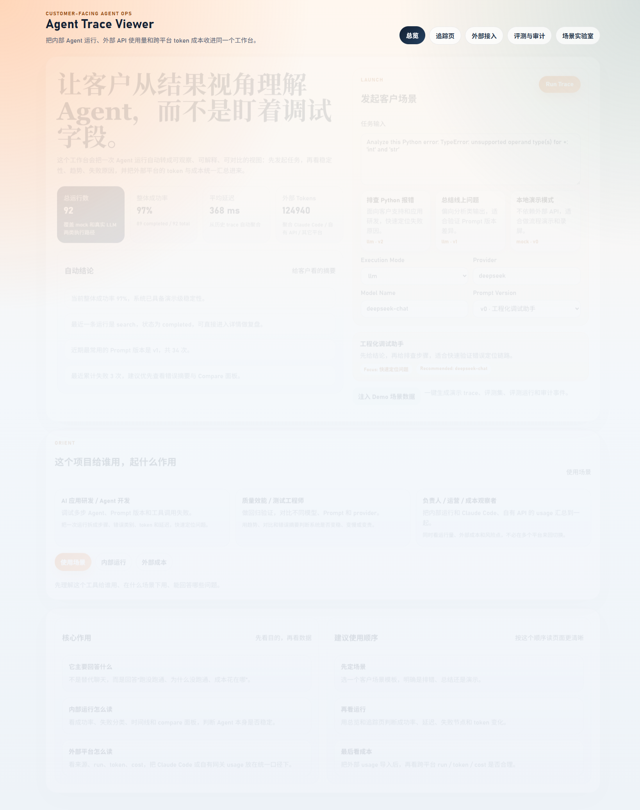
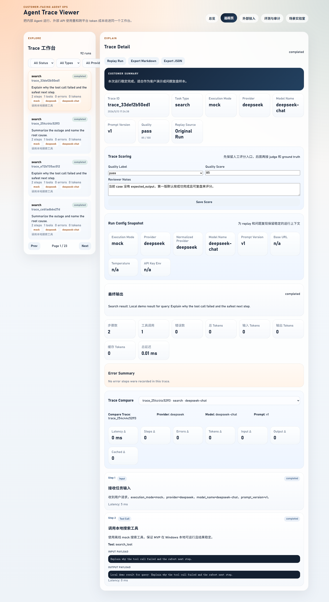
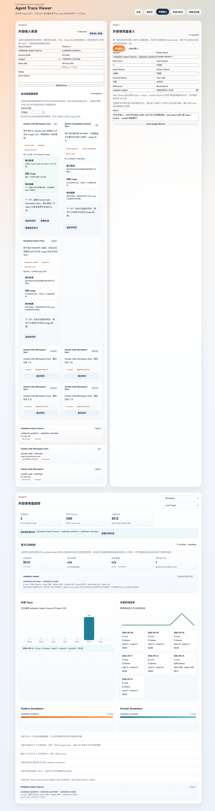
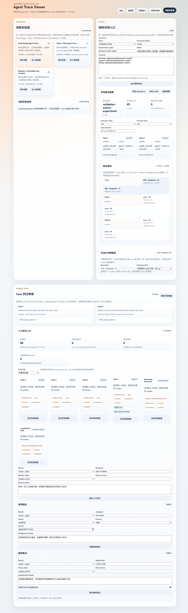

# 前端页面截图与场景 Walkthrough

这份文档的目标不是单纯贴几张页面图，而是帮助第一次体验这个项目的人快速理解：应该先看哪一页、每一页负责回答什么问题、以及本地启动参数为什么这样设置。

## 一键启动

如果只是想把项目拉起来看效果，优先使用仓库内的一键启动脚本：

```powershell
cd d:/llmlearning/agent-trace-viewer
powershell -ExecutionPolicy Bypass -File .\scripts\start-demo.ps1 -InstallDeps
```

如果想先检查脚本会执行哪些命令，而不真正启动前后端，可以先跑：

```powershell
cd d:/llmlearning/agent-trace-viewer
powershell -ExecutionPolicy Bypass -File .\scripts\start-demo.ps1 -DryRun -NoBrowser
```

参数说明：

- `-InstallDeps`：首次体验时建议打开。这样脚本会先补 `pip install -r requirements.txt` 和 `npm install`，减少“命令能跑但依赖没装”的首次阻塞。
- `-DryRun`：只打印即将执行的命令，不真正启动。适合先检查 Python、npm、端口和工作目录是否正确。
- `-NoBrowser`：不自动打开浏览器。适合你已经有页面标签页，或者只想先看服务是否能起来。
- `-BackendPort` / `-FrontendPort`：当本机端口冲突时覆盖默认端口。默认仍是后端 `8000`、前端 `5173`。
- `-BindHost`：默认是 `127.0.0.1`，原因是学习和演示阶段优先本机安全，不主动暴露到局域网。
- `-PythonExe`：当你不想使用默认 `.venv`，或者机器上有多套 Python 时，可以显式指定解释器路径。

## 页面 1：总览



这一页更像客户或负责人视角的入口，不是给你直接查每一个字段，而是先回答“系统整体稳不稳、最近问题在哪、该从哪里开始看”。

建议重点看：

- 顶部 KPI：总运行数、成功率、平均延迟、外部 tokens
- 自动结论：最近失败类型、推荐优先排查方向
- 使用场景 / 内部运行 / 外部成本三种观察视角切换

为什么先看这里：

- 这页先给“结果视角”，避免第一次进系统就陷入细节字段。
- 如果 KPI 和自动结论都稳定，再进入追踪或评测页会更有方向。

## 页面 2：追踪页



这一页是内部运行链路的主工作面，重点看某次 trace 是否跑通、失败发生在哪一步，以及当前 provider / model / prompt_version 的组合是否值得继续保留。

建议重点看：

- Trace 列表筛选和分页
- 单次运行详情、时间线和错误分类摘要
- Replay 与导出入口
- Compare 视图里的延迟、步骤数、错误数、token 差异

为什么第二步看这里：

- 总览页只能告诉你“最近哪里不对劲”，追踪页才负责回答“具体是哪一条运行出了什么问题”。

## 页面 3：外部接入



这一页负责把 Claude Code、自有 API 网关或其它平台导出的 usage 收进统一口径。现在不只支持来源登记和 usage 录入，还带连接器骨架、来源过滤、官方口径校验和趋势联动。

建议重点看：

- 来源登记表单：平台、接入方式、provider、base URL、key hint
- 自动连接器骨架：Claude Code / OpenAI Compatible Gateway / DeepSeek Export
- 外部使用量录入：手动录入和 JSON 导入
- 官方口径校验：`actual / estimated / delta`，以及 `matched / missing official rate`

为什么第三步看这里：

- 前两页主要回答内部 Agent 是否稳定，这一页才把外部成本、来源和客户真实使用路径纳入统一观察面。
- 如果某个 provider/model 没有官方价格快照，页面会直接标成 `missing official rate`，而不是给出看似精确但站不住脚的估算。

## 页面 4：场景实验室



这一页面向评测、复核和实验对照，适合演示“不是只看一次 trace，而是系统性比较不同 provider / prompt / case 组合”。

建议重点看：

- 场景注入：Code Debug、Paper / RAG、Robotics / Embedded
- 矩阵评测入口：suite、execution mode、provider/model/prompt_version 组合
- 实验聚合摘要和版本矩阵
- 多运行对照、人工标注、复核指派和最终裁决

为什么最后看这里：

- 这一页建立在前面三页的运行和数据之上，更适合在体验者已经理解单次 trace 和外部 usage 后，再展示“如何做系统性评测与治理”。

## 推荐演示顺序

1. 先看总览：确认这个工具解决的是“看稳定性、看失败点、看成本”而不是聊天。
2. 再看追踪页：定位一次具体运行，解释 trace、error summary、replay 和 compare。
3. 再看外部接入：说明内部运行之外，为什么还要收敛 Claude Code、自有网关和导出账单的 usage。
4. 最后看场景实验室：展示矩阵评测、人工复核、assignment 和 adjudication 怎么帮助团队形成闭环。

## 当前建议保留的默认参数

- 后端默认端口保留 `8000`：这是当前 FastAPI 主服务默认值，也和前端 API fallback 的第一候选一致。
- 前端默认端口保留 `5173`：这是 Vite 标准开发端口，体验者通常更熟悉，减少额外说明成本。
- API fallback 顺序保留为 `VITE_API_BASE_URL -> 8000 -> 8010`：先尊重显式环境变量，再走当前主默认端口，最后兼容旧端口残留。
- 一键启动默认不开 `-InstallDeps`：原因是老用户反复启动时不需要每次都重装依赖；首次体验时再显式打开即可。
- 一键启动默认自动打开浏览器：原因是体验者最常见目标是“启动后马上看到页面”，不是先盯终端输出。

## 功能与参数检查结果

这一轮补文档前，已经额外做了两类检查：

- 文档参数检查：发现并修正了 Windows 启动文档里的 API fallback 顺序漂移，以及 README 里剩余统计仍停在旧数字的问题。
- 启动脚本检查：`scripts/start-demo.ps1` 已通过 `-DryRun -NoBrowser` 校验，确认能正确解析 Python、npm、后端命令和前端命令。

如果后面还要继续做“更方便分发给体验者”的入口，下一步最自然的是补一个生产构建 + 打包说明，而不是继续堆更多手工命令。